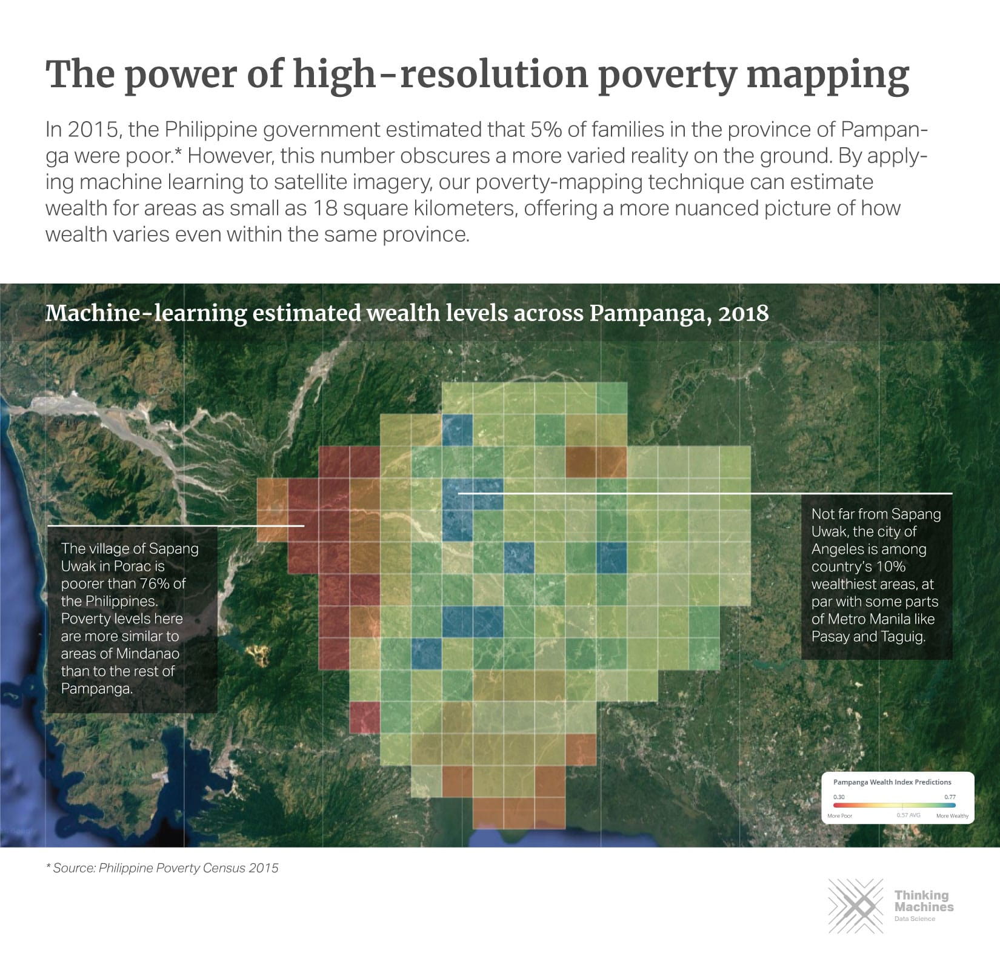

<p align="center">
<b><a href="#setup">Setup</a></b>
|
<b><a href="#code-organization">Code Organization</a></b>
|
<b><a href="#data-sources">Data Sources</a></b>
|
<b><a href="#models">Models</a></b>
|
<b><a href="#key-results">Key Results</a></b>
|
<b><a href="#acknowledgements">Acknowledgements</a></b>
</p>

# Philippine Poverty Mapping

This repository accompanies our [research work](https://aiforsocialgood.github.io/icml2019/accepted/track1/pdfs/7_aisg_icml2019.pdf), 
*"Mapping Philippine Poverty using Machine Learning, Satellite Imagery, and Crowd-sourced Geospatial
Information"*.

The goal of this project is to provide a means for faster, cheaper, and 
more granular estimation of poverty measures in the Philippines using 
machine learning, satellite imagery, and open geospatial data.




## Setup
To get started, run the jupyter notebooks in `notebooks/` in order. 
Note that to run the notebooks, all dependencies must be installed. We provided
a `Makefile` to accomplish this task:

```s
make venv
make build
```

This creates a virtual environment, `venv`, and installs all dependencies found
in `requirements.txt`. In order to run the notebooks inside `venv`, execute the
following command:

```s
ipython kernel install --user --name=venv
```

Notable dependencies include:
- matplotlib==3.0.2
- seaborn==0.9.0
- numpy==1.16.0
- pandas==0.24.0
- torchsummary==1.5.1
- torchvision==0.2.1
- tqdm==4.30.0

## Code Organization 

This repository is divided into three main parts:
- **notebooks/**: contains all Jupyter notebooks for different wealth
    prediction models.
- **utils/**: contains utility methods for loading datasets, building model, and
   performing training routines. 
- **src/**: contains the transfer learning training script.

It is possible to follow our experiments and reproduce the models we've built
by going through the notebooks one-by-one. For model training, we leveraged a
Google Compute Engine (GCE) instance with 16 vCPUs and 60 GB of memory
(n1-standard-16) and an NVIDIA Tesla P100 GPU. 

## Downloading Datasets

### Demographic and Health Survey (DHS)
We used the poverty indicators in the [2017 Philippine Demographic and Health Survey](https://dhsprogram.com/) as a measure of ground-truth for socioeconomic indicators. The survey is conducted every 3 to 5 years, and contains nationally representative information on different indicators across the country.

Due to data access agreements, users need to independently download data files from the Demographic and Health Survey Website. This may require you to create an account and fill out a Data User Agreement form.

Once downloaded, copy and unzip the file in the `/data` directory. The notebook `/notebooks/00_dhs_prep.ipynb` will walk you through how to prepare the dataset for modeling.

### Google Static Maps
We used the Google Static Maps API to download 400x400 px zoom 17 satellite images. To download satellite images and generate training/validation sets, run the following script in the src/ directory:

python data_download.py
Note that this script downloads 134,540 satellite images from Google Static Maps and may incur costs. See [this page](https://developers.google.com/maps/documentation/maps-static/usage-and-billing#static-maps) for more information on Maps Static API Usage and Billing.

To download satellite images and generate training/validation sets, run the following script in `src/`:
```s
python data_download.py
```

## Training the Model
To train the nighttime lights transfer learning model, run the following script in `src/`:
```s
python train.py
```

Usage is as follows:
```s
usage: train.py [-h] [--batch-size N] [--lr LR] [--epochs N] [--factor N]
                [--patience N] [--data-dir S] [--model-best-dir S]
                [--checkpoint-dir S]
Philippine Poverty Prediction
optional arguments:
  -h, --help          show this help message and exit
  --batch-size N      input batch size for training (default: 32)
  --lr LR             learning rate (default: 1e-6)
  --epochs N          number of epochs to train (default: 100)
  --factor N          factor to reduce learning rate by on pleateau (default:
                      0.1)
  --patience N        number of iterations before reducing lr (default: 10)
  --data-dir S        data directory (default: "../data/images/")
  --model-best-dir S  best model path (default: "../models/model.pt")
  --checkpoint-dir S  model directory (default: "../models/")
```

## Data Sources

- **Demographic and Health Survey (DHS)**: we used the socioeconomic indicators in the [2017 Philippine
    Demographic and Health Survey](https://dhsprogram.com/) as our measure of
    ground-truth for socioeconomic indicators. 
- **Nighttime Luminosity Data**: we obtained nighttime lights data from the
    [Visible Infrared Imaging Radiometer Suite Day/Night Band (VIIRS
    DNB)](https://ngdc.noaa.gov/eog/viirs/download_dnb_composites.html) for the
    year 2016. 
- **Daytime Satellite Imagery**: we captured 134,540 satellite images from the
    [Google Static Maps
    API](https://developers.google.com/maps/documentation/maps-static/intro).
    Our
    [parameter](https://developers.google.com/maps/documentation/maps-static/dev-guide)
    settings are as follows: zoom level=17, scale=1, and image
    size=400x400pixels. These images match the land area covered by a single
    pixel of night time lights data (0.25-sq.km). 
- **High Resolution Settlement Data (HRSL)**: we used this dataset, provided by
    [Facebook Research, CIESIN Columbia, and World
    Bank](https://www.ciesin.columbia.edu/data/hrsl/), to filter out images
    containing no human settlements. Their population estimates were based on recent
    census data and high resolution satellite imagery (0.5-m) from
    DigitalGlobe.
- **OpenStreetMaps Data (OSM)**: we acquired crowd-sourced geospatial data from
    [OpenStreetMaps (OSM)](https://www.openstreetmap.org) via the
    [Geofabrik](https://www.geofabrik.de/) online repository. 

## Models

We developed wealth prediction models using different data sources. You can
follow-through our analysis by looking at the notebooks in the `notebooks/`
directory.

- **Nighttime Lights Transfer Learning Model** (`notebooks/03_transfer_model.ipynb`): we used
    a transfer learning approach proposed by Xie et al and Jean et al. The main
    assumption here is that nighttime lights act as a good proxy for economic
    activity. We started with a Convolutional Neural Network (CNN)
    pre-trained on ImageNet, and used the feature embeddings as input into a ridge
    regression model.
- **Nighttime Lights Statistics Model** (`notebooks/01_lights_eda.ipynb`,
    `notebooks/03_lights_model.ipynb`): in this model, we generated nighttime
    light features consisting of summary statistics and histogram-based
    features. We then compared the performance of three different machine
    learning algorithms: ridge regression, random forest regressor, and
    gradient boosting method (XGBoost).
- **OpenStreetMaps (OSM) Model** (`notebooks/04_osm_model.ipynb`): we extracted three
    types of OSM features, roads, buildings, and points-of-interests (POIs)
    within a 5-km radius for rural areas and 2-km radius for urban areas. We
    then trained a random forest regressor on these features.
- **OpenStreetMaps (OSM) + Nighttime Lights (NTL)**
    (`notebooks/02_lights_eda.ipynb`, `notebooks/04_osm_model.ipynb`): we also
    trained a random forest model combining OSM data and nighttime
    lights-derived features as input.

## Citation
Use this bibtex to cite this repository:
```
@misc{ph_poverty_prediction_2018,
  title={Mapping Poverty in the Philippines Using Machine Learning, Satellite Imagery, and Crowd-sourced Geospatial Information},
  author={Tingzon, Isabelle and Orden, Ardie and Sy, Stephanie and Sekara, Vedran and Weber, Ingmar and Fatehkia, Masoomali and Herranz, Manuel Garcia and Kim, Dohyung},
  year={2018},
  publisher={Github},
  journal={GitHub repository},
  howpublished={\url{https://github.com/thinkingmachines/ph-poverty-mapping}},
}
```

## Acknowledgments
This work was supported by the [UNICEF Innovation Fund](https://unicefinnovationfund.org/).

