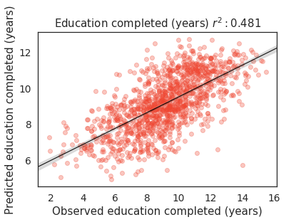
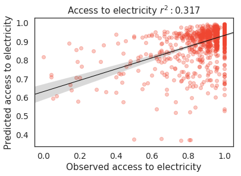
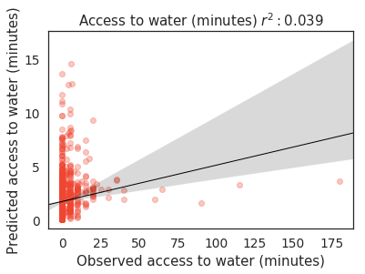
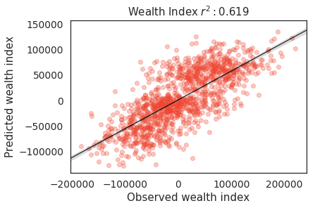

<p align="center">
<b><a href="#setup">Setup</a></b>
|
<b><a href="#code-organization">Code Organization</a></b>
|
<b><a href="#data-sources">Data Sources</a></b>
|
<b><a href="#models">Models</a></b>
|
<b><a href="#key-results">Key Results</a></b>
|
<b><a href="#acknowledgements">Acknowledgements</a></b>
</p>

# Philippine Poverty Mapping

This repository accompanies our research work, *"Mapping Philippine Poverty
using Machine Learning, Satellite Imagery, and Crowd-sourced Geospatial
Information"*, currently published in our
[website](https://stories.thinkingmachin.es/philippines-most-vulnerable-communities/).
In this work, **we developed five wealth prediction models** using
state-of-the-art methods and various geospatial data sources.


## Setup

In order to run the notebooks, all dependencies must be installed. We provided
a `Makefile` to accomplish this task:

```s
make venv
make build
```

This creates a virtual environment, `venv`, and installs all dependencies found
in `requirements.txt`. In order to run the notebooks inside `venv`, execute the
following command:

```s
ipython kernel install --user --name=venv
```

Notable dependencies include:
- matplotlib==3.0.2
- seaborn==0.9.0
- numpy==1.16.0
- pandas==0.24.0
- torchsummary==1.5.1
- torchvision==0.2.1
- tqdm==4.30.0

## Code Organization 

This repository is divided into three main parts:
- **notebooks/**: contains all Jupyter notebooks for different wealth
    prediction models.
- **utils/**: contains utility methods for loading datasets, building model, and
   performing training routines. 
- **src/**: contains the transfer learning training script.

It is possible to follow our experiments and reproduce the models we've built
by going through the notebooks one-by-one. For model training, we leveraged a
Google Compute Engine (GCE) instance with 16 vCPUs and 60 GB of memory
(n1-standard-16). 

## Data Sources

- **Demographic and Health Survey (DHS)**: we used the [2017 Philippine
    Demographic and Health Survey](https://dhsprogram.com/) as our measure of
    ground-truth for socioeconomic indicators. It is conducted every 3 to 5
    years, and contains nationally representative information on different
    indicators across the country. 
- **Nighttime Luminosity Data**: we obtained nighttime lights data from the
    [Visible Infrared Imaging Radiometer Suite Day/Night Band (VIIRS
    DNB)](https://ngdc.noaa.gov/eog/viirs/download_dnb_composites.html) for the
    year 2016. It includes a continuous luminosity level from 0 to 122, where 0
    is the darkest pixel.
- **Daytime Satellite Imagery**: we captured 134,540 satellite images from the
    [Google Static Maps
    API](https://developers.google.com/maps/documentation/maps-static/intro).
    Our
    [parameter](https://developers.google.com/maps/documentation/maps-static/dev-guide)
    settings are as follows: zoom level=17, scale=1, and image
    size=400x400pixels. These images match the land area covered by a single
    pixel of night time lights data (0.25-sq.km). 
- **High Resolution Settlement Data (HRSL)**: we used this dataset, provided by
    [Facebook Research, CIESIN Columbia, and World
    Bank](https://www.ciesin.columbia.edu/data/hrsl/), to filter out images
    without human settlements. Their population estimates were based on recent
    census data and high resolutoin satellite imagery (0.5-m) from
    DigitalGlobe.
- **OpenStreetMaps Data (OSM)**: we acquired crowd-sourced geospatial data from
    [OpenStreetMaps (OSM)](https://www.openstreetmap.org) via the
    [Geofabrik](https://www.geofabrik.de/) online repository. This dataset is
    volunteer-curated, and covers almost 83% of the entire Philippine street
    network.

## Models

We developed five wealth prediction models from different data sources. You can
follow-through our analysis by looking at the notebooks in the `notebooks/`
directory.

- **Survey Model** (`notebooks/01_survey_model.ipynb`): we extracted features
    such as urban/rural classification, proportion of households with a
    car/truck, avg. number of rooms used for sleeping, and etc. This model
    serves as our baseline or "gold standard" against which other
    remote-sensing based techniques will be compared.
- **Nighttime Lights Transfer Learning Model** (`notebooks/04_transfer_model.ipynb`): we used
    a transfer learning approach proposed by Xie et al and Jean et al. The main
    assumption here is that nighttime lights act as a good proxy for economic
    activity. We first started with a Convolutional Neural Network (CNN)
    pre-trained on ImageNet, and used the feature vectors into a ridge
    regression model.
- **Nighttime Lights Statistics Model** (`notebooks/02_lights_eda.ipynb`,
    `notebooks/03_lights_model.ipynb`): in this model, we generated nighttime
    light features consisting of summary statistics and histogram-based
    features. We then compared the performance of three different machine
    learning algorithms: ridge regression, random forest regressor, and
    gradient boosting method (XGBoost).
- **OpenStreetMaps (OSM) Model** (`notebooks/05_osm_model.ipynb`): we extracted three
    types of OSM features, roads, buildings, and points-of-interests (POIs)
    within a 5-km radius for rural areas and 2-km radius for urban areas. We
    then trained a random forest regressor for these features.
- **OpenStreetMaps (OSM) + Nighttime Lights (NTL)**
    (`notebooks/02_lights_eda.ipynb`, `notebooks/05_osm_model.ipynb`): we also
    trained a random forest model combining OSM data and nighttime
    lights-derived features as input. This is motivated by the assumption that
    using features from mixed data sources will improve model performance.

## Key Results

To view the full results, please see our technical notes
[here](https://stories.thinkingmachin.es/philippines-most-vulnerable-communities/).
We found out that for the four models (excluding the survey model), OSM-based
features serve as a good previctor for socioeconomic well-being:

<p align="center">
<b>Cross-validated r-squared results for predicting cluster-level poverty
measures across all levels</b>

|                       | Survey | Lights | Transfer | OSM   | OSM + Lights |
|-----------------------|--------|--------|----------|-------|--------------|
| Wealth Index          | 0.789  | 0.563  | 0.593    | 0.591 | 0.619        |
| Education             | 0.605  | 0.427  | 0.440    | 0.459 | 0.481        |
| Access to Electricity | 0.368  | 0.267  | 0.219    | 0.287 | 0.317        |
| Access to Water       | 0.030  | 0.018  | 0.047    | 0.038 | 0.039        |

</p>

<p align="center">
<b>Predictions on different socioeconomic indicators using the OSM + Lights
model</b>
</p>






## Acknowledgments

This work was supported by the [UNICEF Innovation
Fund](https://unicefinnovationfund.org/). We would also like to thank Vedran
Sekara, Do-Hyung Kim of UNICEF and Priscilla Moraes of Google for the
insightful discussions and valuable mentorship.


